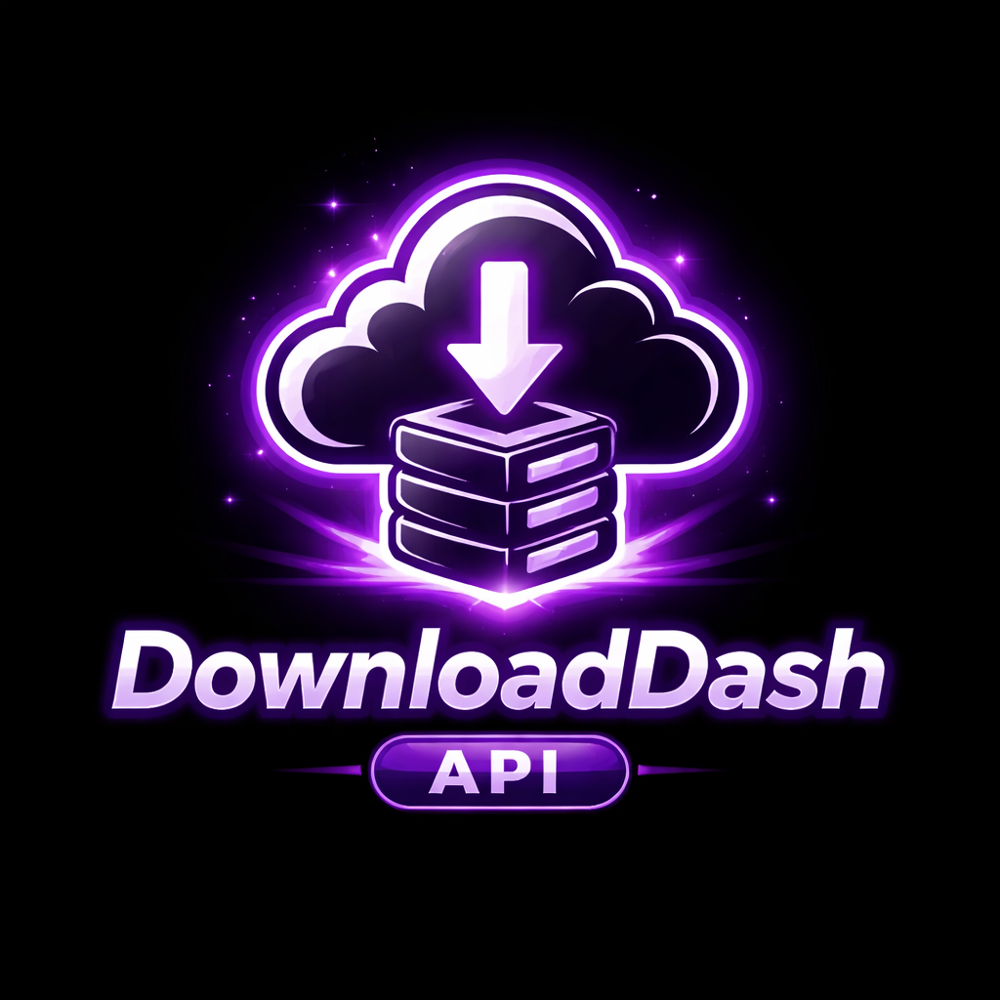

# DownloadDash API

## Run locally (Windows / PowerShell)

From the repo root (recommended one-command start):

```powershell
npm run setup
npm run dev
```

If PowerShell blocks `npm` with an execution policy error, use `npm.cmd` instead:

```powershell
npm.cmd run setup
npm.cmd run dev
```

### 1) Start WhatsApp bridge (optional)

```powershell
cd .\social-media-downloader-api\whatsapp-bridge
node .\index.js
```

Bridge runs on `http://localhost:3001`.

### 1b) Start WhatsApp Business bridge (optional)

```powershell
cd .\social-media-downloader-api\whatsapp-bridge
node .\index-business.js
```

Bridge runs on `http://localhost:3005`.

### 1c) Start Telegram bridge (optional)

```powershell
cd .\social-media-downloader-api\telegram-bridge
set TELEGRAM_BOT_TOKEN=YOUR_BOT_TOKEN
node .\index.js
```

Bridge runs on `http://localhost:3004`.

### 2) Start the FastAPI server

In a new terminal:

```powershell
cd .\social-media-downloader-api
.\venv\Scripts\Activate.ps1
python -m uvicorn app.main:app --reload
```

Open:

- API root: `http://127.0.0.1:8000/`
- Swagger UI: `http://127.0.0.1:8000/docs`
- All platform statuses: `http://127.0.0.1:8000/status`

Troubleshoot:

```powershell
npm run doctor
```

## Platform endpoints

Public platforms (yt-dlp, no server-side file saving):

- `POST /download`
- `POST /instagram/download`
- `POST /tiktok/download`
- `POST /facebook/download`
- `POST /reddit/download`
- `POST /pinterest/download`
- `POST /twitter/download`
- `POST /youtube/download`

Messaging:

- `GET /whatsapp/qr`, `GET /whatsapp/status`
- `GET /whatsapp-business/qr`, `GET /whatsapp-business/status`
- `GET /telegram/status` (Telegram downloads not configured yet)

## Notes

- These endpoints resolve a **direct media URL** (and metadata) via `yt-dlp` but **do not download or save** the media on the API server.
- Your client app (DownloadDash) should handle downloading/saving to the user’s device.
- WhatsApp/WhatsApp Business status/story saving requires the Node bridges running (`whatsapp-bridge`) (optional; not started by default).
- Telegram media sync requires the Telegram bridge and a bot token (see section 1c).
- Stories/status downloading for other platforms requires login/cookies/session support (not implemented yet).
